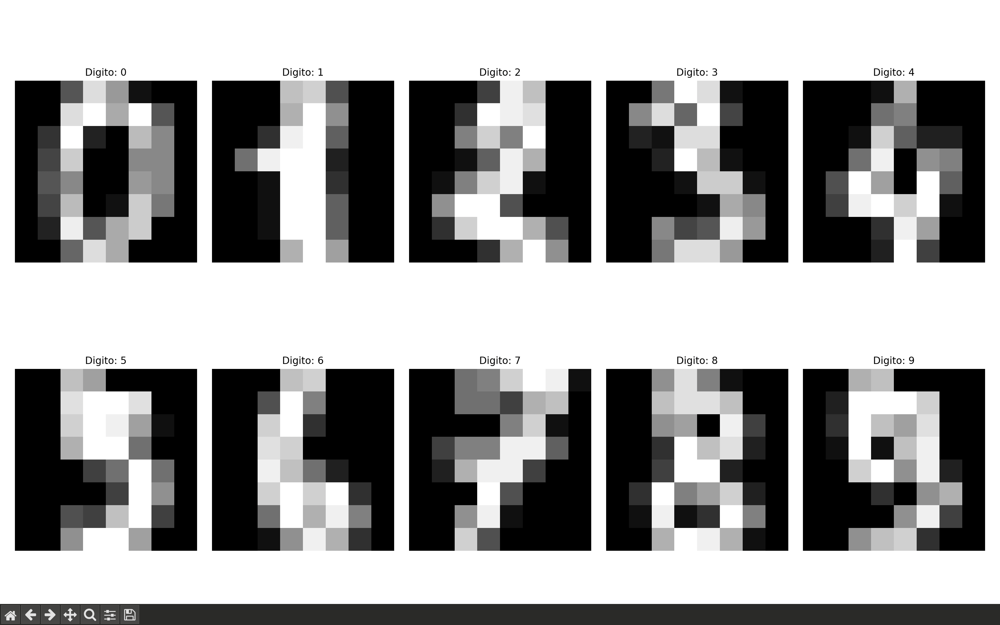
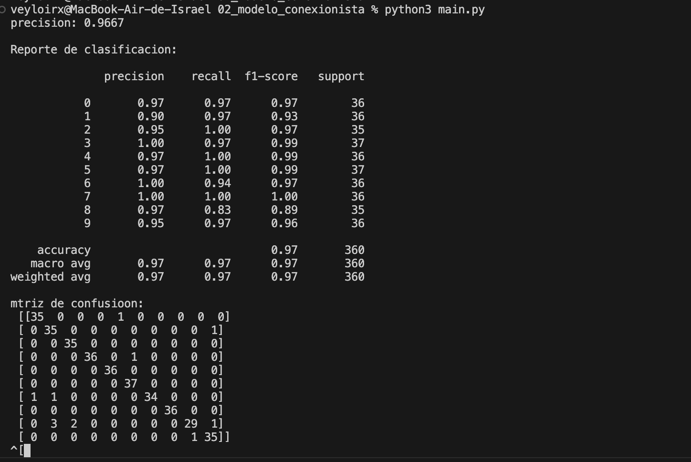

# Objetivo de la práctica

Comprender y aplicar el modelo conexionista mediante una **Red Neuronal Artificial (RNA)** para clasificar imágenes de dígitos escritos a mano, utilizando la base de datos **Digits** disponible en *scikit-learn*.

---

# Instrucciones paso a paso

1. Importa las librerías necesarias: *numpy*, *matplotlib*, *sklearn*.  
2. Carga la base de datos con `load_digits()`.  
3. Visualiza algunas imágenes para familiarizarte con los datos.  
4. Divide los datos en entrenamiento (80%) y prueba (20%).  
5. Crea un modelo de red neuronal multicapa con `MLPClassifier`.  
6. Entrena la red con los datos de entrenamiento.  
7. Evalúa el modelo con el conjunto de pruebas.  
8. Calcula la precisión y genera una matriz de confusión.  
9. Reflexiona sobre los resultados:  
   - ¿Qué tan preciso fue el modelo?  
   - ¿Dónde se equivocó más?  
   - ¿Cómo cambian los resultados si modificas el número de capas y neuronas?

---

# Visualización de los datos

A continuación se muestran algunos de los dígitos presentes en el dataset *Digits (MNIST reducido)*.  
Estas imágenes corresponden a tu ejecución del programa:

Cada imagen tiene tamaño **8x8 píxeles**, representada en escala de grises. Esto facilita su uso con redes neuronales pequeñas como un MLP.

---

# Resultados del modelo

Tras entrenar el MLPClassifier con los datos del conjunto *Digits*, se obtuvieron resultados como:

- **Precisión del modelo:** 0.9667 
- La matriz de confusión muestra cómo se comportó el modelo para cada clase.

---

## ¿Qué tan preciso fue el modelo?

El modelo obtuvo una precisión **muy alta**, cercana al 97%, lo cual demuestra que la Red Neuronal Multicapa es capaz de aprender patrones visuales aun cuando las imágenes son de muy baja resolución (8x8).  
Esto confirma que incluso una red relativamente sencilla puede clasificar dígitos con buena precision. 

---

## ¿Dónde se equivocó más?

- Los errores más comunes suelen aparecer entre dígitos **visualmente parecidos**, por ejemplo:
  - 8 y 9  
  - 3 y 5  
  - 4 y 9  

Estos errores se deben a que las imágenes son muy pequeñas y algunos trazos pueden parecerse demasiado entre sí.

---

## ¿Cómo cambian los resultados si modificas el número de capas y neuronas?

- **Más capas o más neuronas**  
  Aumentan la capacidad del modelo para aprender patrones complejos, lo que puede mejorar la precisión.  
  Sin embargo, también aumenta el tiempo de entrenamiento y existe riesgo de sobreajuste si el modelo es demasiado grande.

- **Menos capas o menos neuronas**  
  El modelo se vuelve más rápido, pero puede perder capacidad de aprendizaje y cometer más errores.

- **Cambiar funciones de activación o el optimizador (Adam, SGD)**  
  También influye en la convergencia y calidad del aprendizaje.

En general, el dataset Digits no requiere redes profundas; configuraciones simples como `(64, 32)` funcionan muy bien.

---

# Conclusión

La práctica permitió comprender el funcionamiento de una **Red Neuronal Artificial** tipo **MLPClassifier**, aplicada al reconocimiento de dígitos manuscritos. 
El modelo es altamente eficiente aun con datos de baja resolución. 
La red neuronal aprende patrones visuales sin necesidad de técnicas avanzadas.  
Ajustar la arquitectura (capas y neuronas) tiene impacto directo en el rendimiento.  

