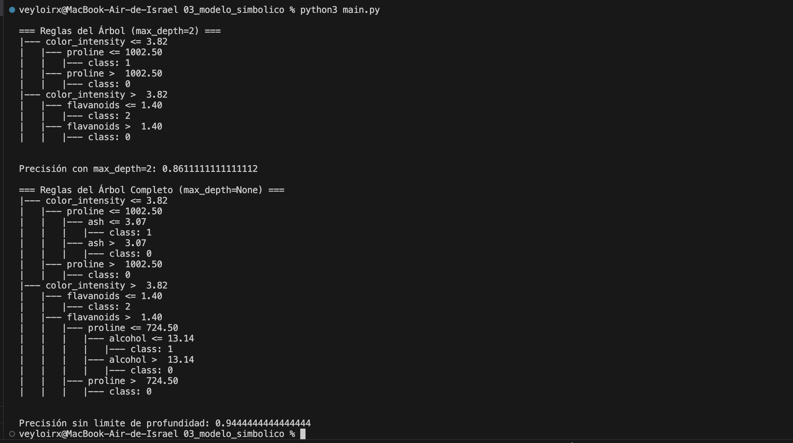

# Clasificación con Árbol de Decisión — Wine Dataset  
### Reporte y analisis de resultados

## Objetivo de la práctica
- Entrenar un modelo **DecisionTreeClassifier** para clasificar vinos.
- Comprender cómo funciona un **modelo simbólico basado en reglas**.
- Analizar las reglas generadas por el árbol.
- Comparar un árbol limitado (`max_depth=2`) contra un árbol completo (`max_depth=None`).
- Evaluar la precisión en ambos casos.

---

## Descripción breve del Wine Dataset
El dataset Wine (scikit-learn) contiene:

- **178 muestras de vino**
- **13 características químicas**, como:
  - alcohol  
  - ácido málico  
  - cenizas  
  - flavonoides  
  - magnesio  
  - proline  
- **3 clases** (0, 1, 2), correspondientes a tres tipos de vino italiano.

Este dataset es ideal para estudiar clasificación y modelos interpretables.

---

## Árbol de decisión como modelo simbólico
Un árbol de decisión es un modelo **basado en reglas tipo if–then**:

- Cada nodo representa una pregunta (ejemplo: *¿alcohol ≤ 12.8?*)
- Las ramas representan respuestas (sí/no)
- Las hojas representan la clase asignada

Esto lo hace **interpretable**, a diferencia de redes neuronales o modelos “caja negra”.

---

## Resumen de pasos realizados
1. Se importaron las librerías necesarias.  
2. Se cargó el dataset del vino.  
3. Se dividió en entrenamiento y prueba.  
4. Se entrenó un árbol limitado (`max_depth=2`).  
5. Se visualizaron las reglas generadas.  
6. Se calculó su precisión.  
7. Se entrenó un árbol completo (`max_depth=None`).  
8. Se compararon reglas y precisión.

**Cambio:** Solo se alteró el parámetro `max_depth` en el segundo modelo.

---

# Resultados

El árbol limitado (max_depth=2) genera reglas simples y buena precisión.
El árbol completo aumenta la precisión, pero las reglas se vuelven largas y específicas.
Se observa el efecto de la profundidad en interpretabilidad y riesgo de sobreajuste.
La práctica permite comparar modelos simbólicos simples vs complejos de forma clara.
