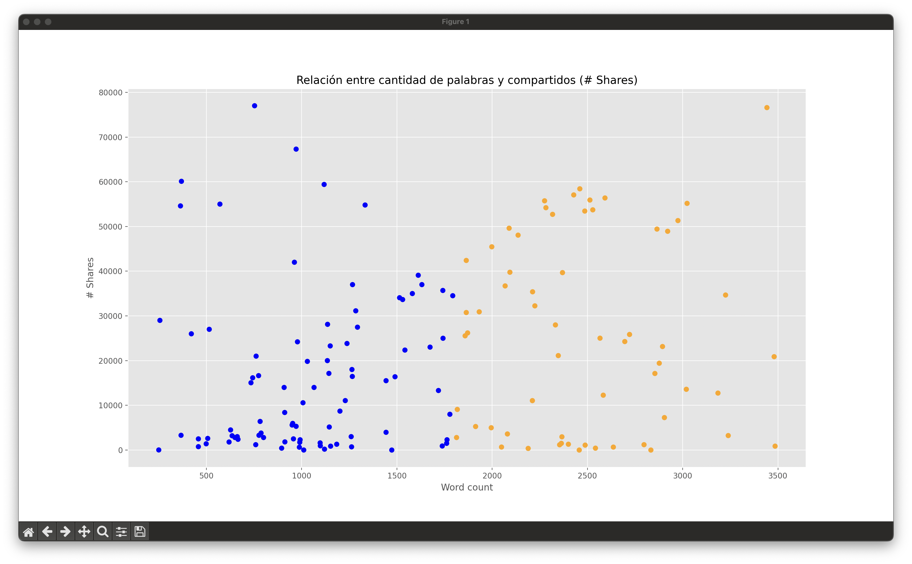
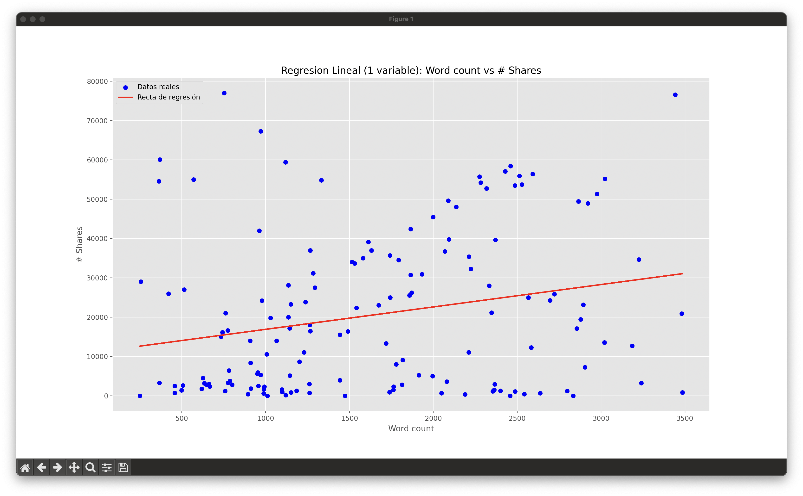
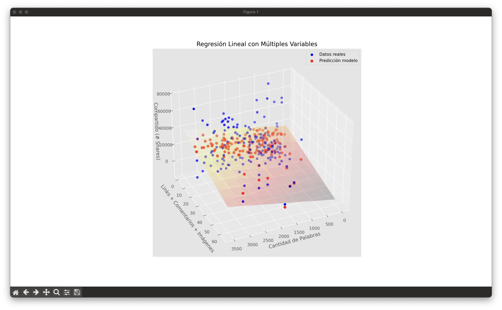
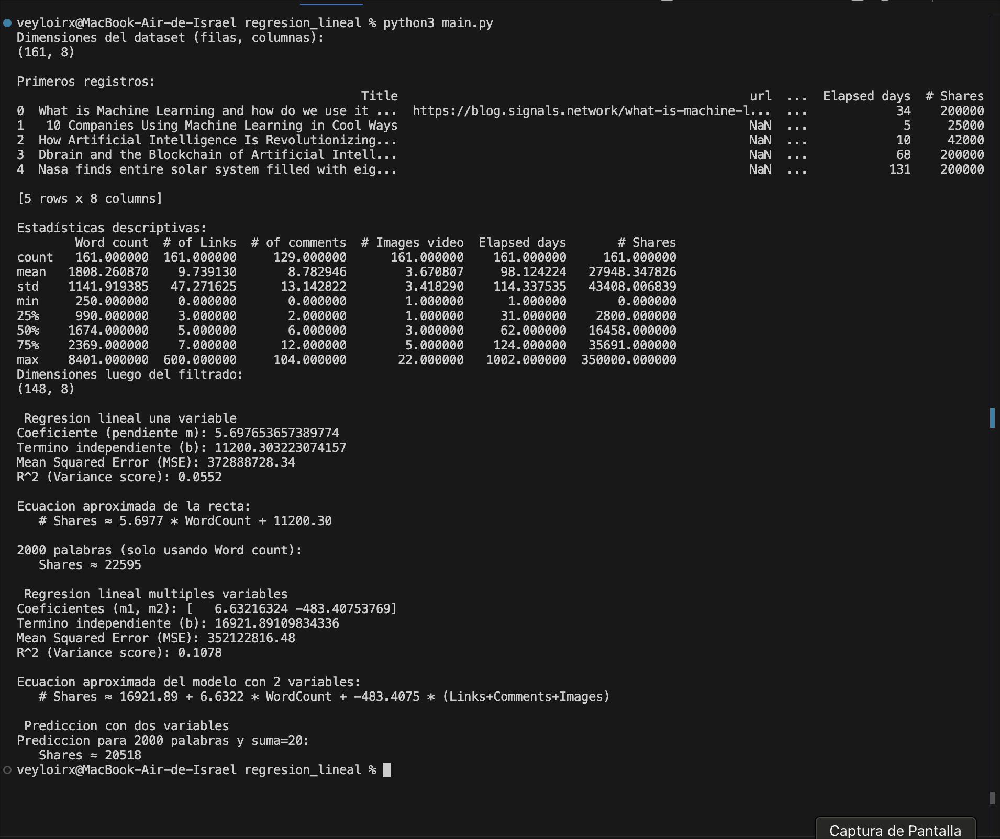

## Introducción

La regresión lineal es una técnica estadística utilizada para modelar la relación entre una variable dependiente y una o más variables independientes.  
En esta práctica se analiza si existe correlación entre:

- **Cantidad de palabras de un artículo (Word count)**  
- **Cantidad de veces que dicho artículo es compartido (# Shares)**  

Posteriormente, el modelo se amplía agregando una segunda variable compuesta por:

- Número de enlaces  
- Número de comentarios  
- Número de imágenes o videos  

## Dataset 

El archivo `articulos_ml.csv` contiene **161 registros** y **8 columnas**, entre ellas:

- `Title`
- `Word count`
- `# Shares`
- `# of Links`
- `# of comments`
- `# Images video`
- `Elapsed days`

Se observó que los artículos varían entre **250 y 8401 palabras**, mientras que los compartidos tienen un rango amplio de **0 a 350,000**.

---

## Filtrado de datos

Para reducir ruido y valores atípicos, se aplicó el siguiente filtro:

- `Word count` ≤ 3500  
- `# Shares` ≤ 80000  

Esto redujo el dataset a **148 registros**, concentrando los puntos en la zona relevante para el análisis.

Además, se graficaron los datos coloreando:

- **Azul** → artículos con menos de 1808 palabras (debajo de la media)  
- **Naranja** → artículos con más de 1808 palabras  

## Regresión Lineal con Una Variable  
**Variable independiente:** `Word count`  
**Variable dependiente:** `# Shares`

Modelo entrenado con:

Shares ≈ m * WordCount + b

### Resultados del modelo simple

- **Pendiente (m):** 5.6977  
- **Término independiente (b):** 11200.30  
- **MSE:** 372,888,728.34  
- **R²:** 0.0552  

### Predicción ejemplo

Para un artículo de **2000 palabras**:

Shares ≈ 22595

### Interpretación  

El valor de R² = **0.0552** indica que **solo el 5.5%** de la variabilidad en los compartidos se explica por la cantidad de palabras.  
La relación es **muy débil**, lo cual sugiere que `Word count` por sí solo **no determina** cuántas veces un artículo será compartido.

---

## Regresión Lineal con Múltiples Variables  
Se agrega una nueva variable:

suma = # Links + # Comments + # Images

El modelo ahora es:

Shares ≈ b + m1 * WordCount + m2 * suma

### Resultados del modelo múltiple

- **m1:** 6.6322  
- **m2:** –483.4075  
- **b:** 16921.89  
- **MSE:** 352,122,816.48  
- **R²:** 0.1078  

### Predicción ejemplo

Para **2000 palabras** y una suma de **20**:

Shares ≈ 20518

## Visualización 3D del plano de regresión

El plano se generó usando `meshgrid()` y graficando:

- Puntos reales (azul)
- Puntos predichos (rojo)
- Plano del modelo (gradiente térmico)

Esta gráfica permite observar cómo el modelo intenta ajustar la superficie sobre el espacio formado por las dos variables predictoras.

La salida en consola confirma lo anterior:

