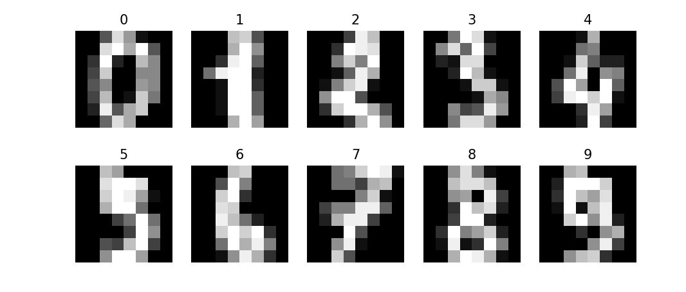
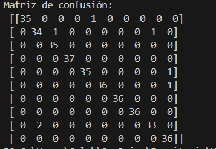
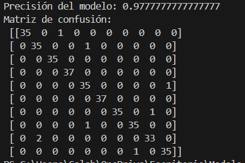
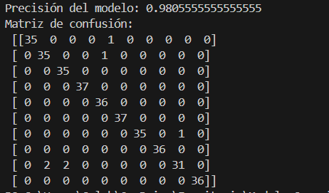
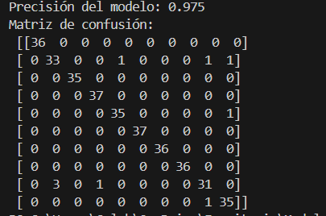

# Modelo: Red Neuronal Multicapa (MLPClassifier)

Las **Redes Neuronales Artificiales (RNA)** están inspiradas en el funcionamiento del cerebro humano, donde millones de neuronas biológicas se conectan entre sí para transmitir y procesar información.

En computación, una **neurona artificial** es una función matemática que recibe una serie de entradas, las combina mediante un peso y un sesgo, y produce una salida que pasa por una función de activación.

El modelo de red más utilizado en problemas de clasificación supervisada es la **Red Neuronal Multicapa (MLP, Multi-Layer Perceptron)**.

---

## Características principales de un MLP

### Capas de la red

- **Capa de entrada**: recibe los datos.  
  En este caso, las imágenes de los dígitos en forma de vectores de 64 características.

- **Capas ocultas**: una o varias capas intermedias que transforman la información aprendida.  
  Mientras más capas y neuronas tenga la red, mayor será su capacidad de representar patrones complejos.

- **Capa de salida**: entrega la predicción final.  
  Para MNIST (dígitos del 0 al 9) habrá 10 neuronas de salida, una por cada posible número.

### Pesos y aprendizaje

Cada conexión entre neuronas tiene un **peso**, que indica la importancia de la señal. Durante el entrenamiento, el algoritmo ajusta los pesos para reducir el error en las predicciones.

### Funciones de activación

Las funciones de activación introducen **no linealidad** en la red, permitiendo resolver problemas más complejos que una simple combinación lineal.

### Entrenamiento mediante _backpropagation_

El MLP utiliza un proceso de **retropropagación del error (backpropagation)** junto con un optimizador (ej. _SGD_ o _Adam_) para ajustar los pesos y minimizar la función de pérdida.

---

## Dataset: Digits (MNIST reducido)

- **Origen**: incluido en `sklearn.datasets` como `load_digits()`.
- **Descripción**: 1,797 imágenes de dígitos manuscritos, cada imagen es de 8x8 píxeles (64 valores en escala de grises).

  

- **Etiquetas**: el número real que representa cada imagen.

---

## Objetivo de la práctica

Comprender y aplicar el modelo conexionista mediante una **Red Neuronal Artificial** para clasificar imágenes de dígitos escritos a mano, utilizando la base de datos **Digits** disponible en _scikit-learn_.

---

## Instrucciones paso a paso

1. Importa las librerías necesarias: `numpy`, `matplotlib`, `sklearn`.
2. Carga la base de datos con `load_digits()`.
3. Visualiza algunas imágenes para familiarizarte con los datos.
4. Divide los datos en entrenamiento (80%) y prueba (20%).
5. Crea un modelo de red neuronal multicapa con `MLPClassifier`.
6. Entrena la red con los datos de entrenamiento.
7. Evalúa el modelo con el conjunto de pruebas.
8. Calcula la precisión y genera una matriz de confusión.

---

## Reflexiona sobre los resultados

### ¿Qué tan preciso fue el modelo?

Precisión del modelo: 0.9805555555555555

### ¿Dónde se equivocó más?

Como se puede Observar : confundio 0 con 4, confundio 1 con el 2 y con el 8, confundio el 4 con el 9, confundio el 5 con el 9, confundio el 8 con el 1 de nuevo

### ¿Cómo cambian los resultados si modificas el número de capas y neuronas?

Si cambio la capa a 70 tengo una precision de 0.9777777777777777
si cambio la capa a 90 tengo una precision de 0.9805555555555555  
si cambio la capa a 100 tengo una presicion de 0.975

