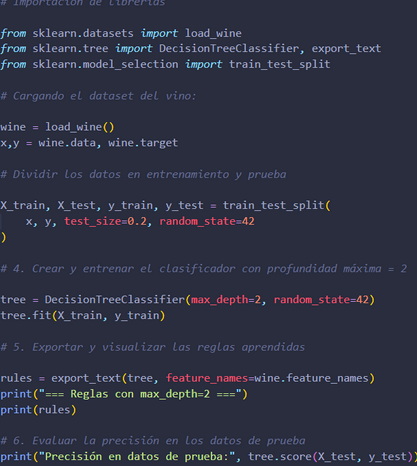
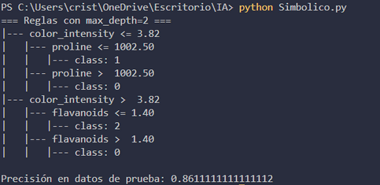
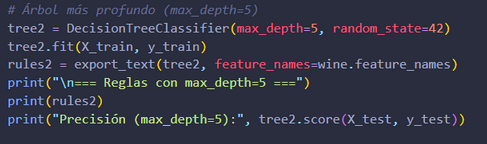
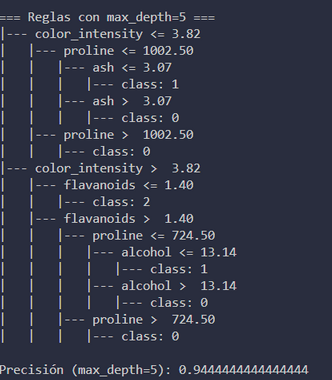
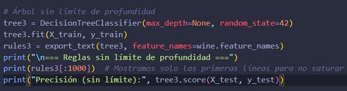
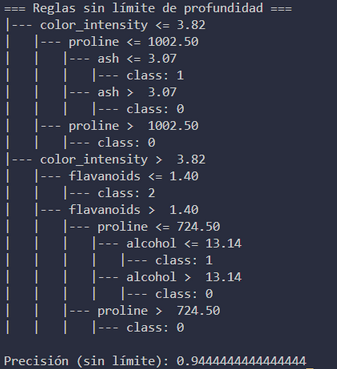

# Reglas de Clasificación con Árbol de Decisión (Wine Dataset)

## El árbol de decisión es un modelo simbólico porque:

- Clasifica los datos siguiendo reglas condicionales del tipo si-entonces.
- Cada nodo del árbol representa una pregunta sobre una característica (ejemplo: ¿alcohol ≤ 12.8?).
- Las ramas son las respuestas (sí o no).
- Las hojas finales representan la clase asignada (tipo de vino).

## • El Wine dataset (incluido en scikit-learn) es un conjunto de datos clásico de clasificación:

## • Contiene 178 muestras de vino.

## • Cada vino tiene 13 características químicas medidas en laboratorio, como:

- Alcohol
- Ácido málico
- Cenizas
- Magnesio
- Flavonoides
- Proline (aminoácido relacionado con la uva)

## Los vinos están clasificados en 3 clases (0, 1, 2) que representan 3 tipos de vino cultivados en la región italiana de Piamonte.

---

## Objetivo de la Practica

- Aprender a entrenar un árbol de decisión como clasificador simbólico.
- Comprender cómo el modelo genera *reglas lógicas interpretables*.
- Explorar un dataset real y analizar sus características.

---

## ⚙ Instrucciones paso a paso

## 1. Importar librerías

python
from sklearn.datasets import load_wine
from sklearn.tree import DecisionTreeClassifier, export_text
from sklearn.model_selection import train_test_split

- load_wine → carga el dataset del vino.
- DecisionTreeClassifier → crea el clasificador basado en reglas.
- export_text → visualiza las reglas aprendidas.
- train_test_split → divide los datos en entrenamiento y prueba.

---

## 2. Cargar el dataset

wine = load_wine()
X, y = wine.data, wine.target

- X contiene las características químicas del vino.
- y contiene la clase (0, 1 o 2 ) corresponden a 3 tipos de vino.

---

## 3. Dividir datos

- 80% para entrenamiento.
- 20% para prueba.

---

## 4. Crear y entrenar el clasificador

- max_depth=2 limita la profundidad del árbol para que las reglas sean más fáciles de interpretar.

---

### 5. Exportar y visualizar reglas

rules = export_text(tree, feature_names=wine.feature_names)
print(rules)

---

##  Actividades sugeridas

1.  Cambia el parámetro max_depth de DecisionTreeClassifier y observa cómo cambian las reglas del árbol.

  

2.  Prueba a entrenar el modelo sin limitar la profundidad (max_depth=None). ¿Qué notas en las reglas?

3.  Evalúa la precisión del modelo en los datos de prueba:
    print("Precisión en datos de prueba:", tree.score(X_test, y_test))

4.  Cuales son tus opiniones de los resultados.

## Elaboración

### Código:

### Resultado:

### Actividades:

- Cambio de parametro

- Resultado
  
  

- Cambio sin limite

- Resultado

### Opiniones y concluciones

- Utilizando max_depth 2 las reglas son pocas, es más sencillo y por lo cual puede equivocarse en casos más difíciles.

- En el caso de max_depth 5, el arbol tiene mas que considerar asi que las reglas son mas largas, hay más complejidad pero mas precisión

- Utilizando max_depth none o 0, sin tener algún límite, el árbol crecerá hasta separar todos los vinos perfectamente, ya que se le están dando todos los datos, memorizaba todo, eso si las reglas son muy largas demasiadas, es un entrenamiento de 100 % de precisión.

### Precisiones

Las precisiones en la clasificaciones de vinos, varios dependiente el nivel de profundidad establecido:

- max_depth=2 → Precisión: 0.87 (87%)
- max_depth=5 → Precisión: 0.94 (94%)
- max_depth=None → Precisión: 1.00 en entrenamiento, pero 0.94–0.97 en prueba

En resumen si el maxdepth es muy pequeño el árbol es muy simple y no aprende bien es un sobreajuste, si maxdepth es demasiado grande (0) el árbol memoriza y pierde capacidad de generalizar, un sobreajuste, en el caso de utilizar un maxdepth de entre 3 a 5 nos da un balance, da buena precisión  y reglas que son entendibles y lo suficientemente concretas.
