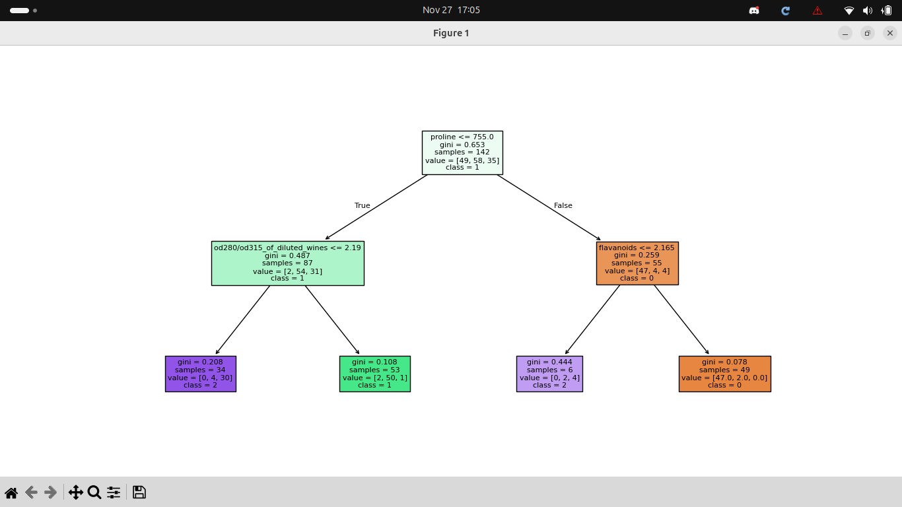
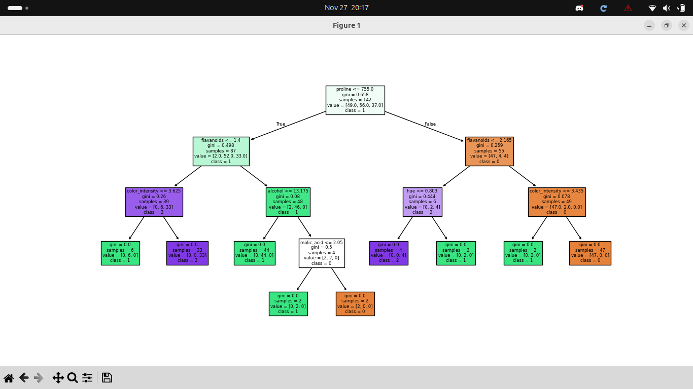
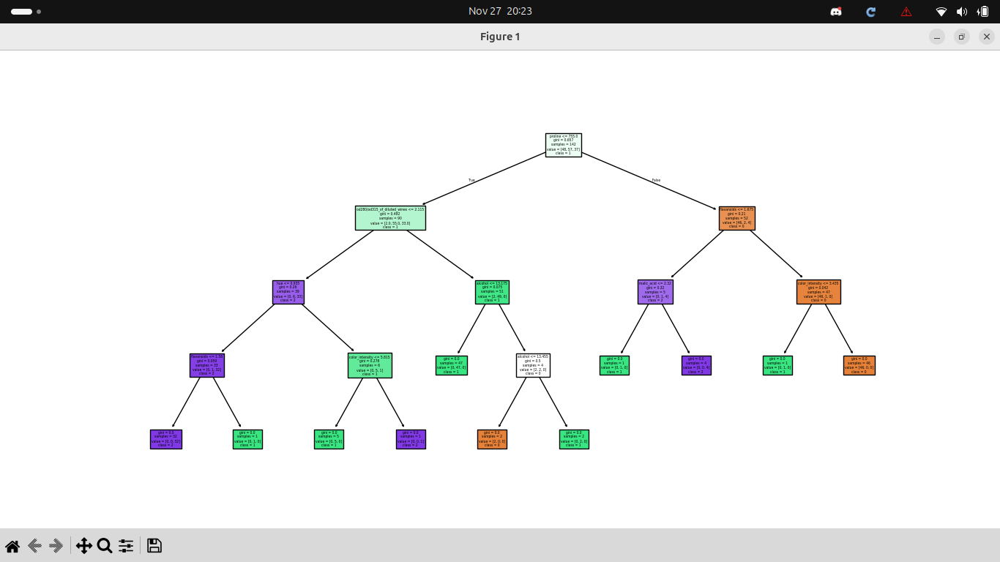

# Instrucción de clase 

## Reglas de Clasificación con Árbol de Decisión (Wine Dataset)
 Utilizando el clasificador de Árbol de Decisión y la base de datos de  Vino (wine dataset) realiza l.a siguiente practica con python y sckit learn.

## ¿Qué es un arbol de decisión?
  Un árbol de decisión es un modelo de aprendizaje supervisado que se usa tanto para clasificación como para regresión.Su estructura se asemeja a un árbol, donde:
* Cada nodo interno representa una pregunta o condición sobre una característica.
* Cada rama representa una respuesta posible (por ejemplo: “Sí” o “No”).
* Cada hoja representa una decisión o resultado final (por ejemplo: una clase o un valor numérico).


## Requisitos
Instalar las siguientes librerías de Python:

``` pip install scikit-learn numpy scipy ```

```pip install matplotlib``` (poderlo observar de manera grafica como se esta entrenando el arbol)

## El Wine dataset (incluido en scikit-learn) es un conjunto de datos clásico de clasificación:
* Contiene 178 muestras de vino.
* Cada vino tiene 13 características químicas medidas en laboratorio, como:
1. Alcohol
2. Ácido málico
3. Cenizas
4. Magnesio
5. Flavonoides
6. Proline (aminoácido relacionado con la uva)
7. Los vinos están clasificados en 3 clases (0, 1, 2) que  representan 3 tipos de vino cultivados en la región italiana de Piamonte.

## Objetivo de la práctica
* Aprender a entrenar un árbol de decisión como clasificador simbólico.
* Comprender cómo el modelo genera reglas lógicas interpretables.
* Explorar un dataset real (vino) y analizar sus características.

##  Actividades
Cambia el parámetro max_depth de DecisionTreeClassifier y observa cómo cambian las reglas del árbol.
 Imagen 1
, aqui lo deje con limite en max_depth= 2

 Imagen 2, y en esta aumento a 5

Prueba a entrenar el modelo sin limitar la profundidad (max_depth=None). ¿Qué notas en las reglas?


### Evalúa la precisión del modelo en los datos de prueba:
print("Precisión en datos de prueba:", tree.score(X_test, y_test))
Cuales son tus opiniones de los resultados.

segun el nivel de profundidad que decidimos darle es como un limite de preguntas pero si usamos el **none** le estamos dicinedo que este no tiene un limite yo siento que es como decir el maximo de hojas o ramas que podra hacer
